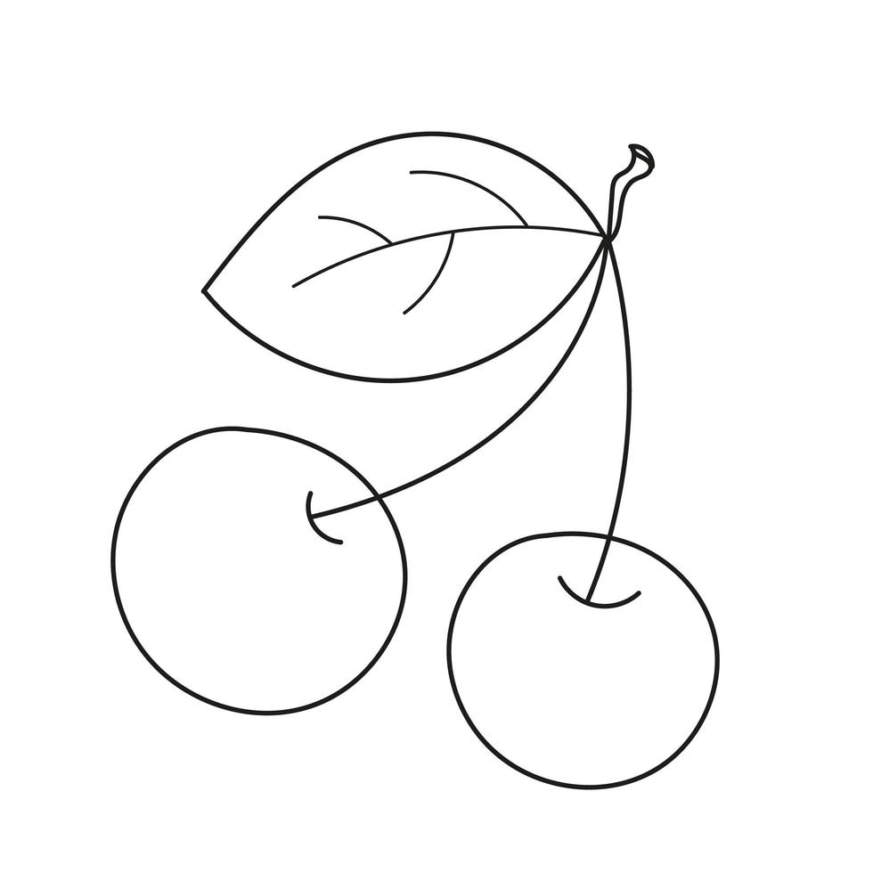
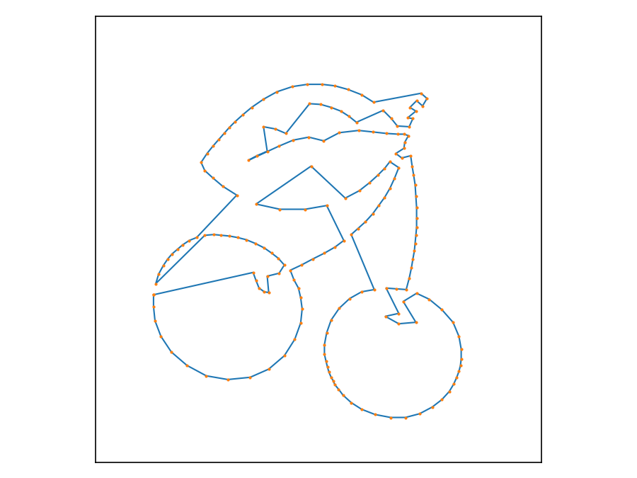
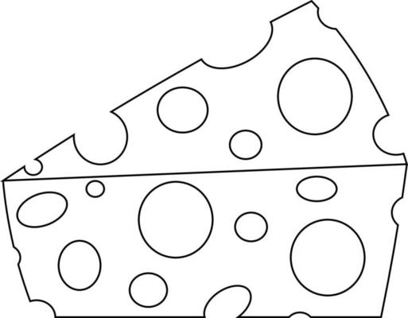
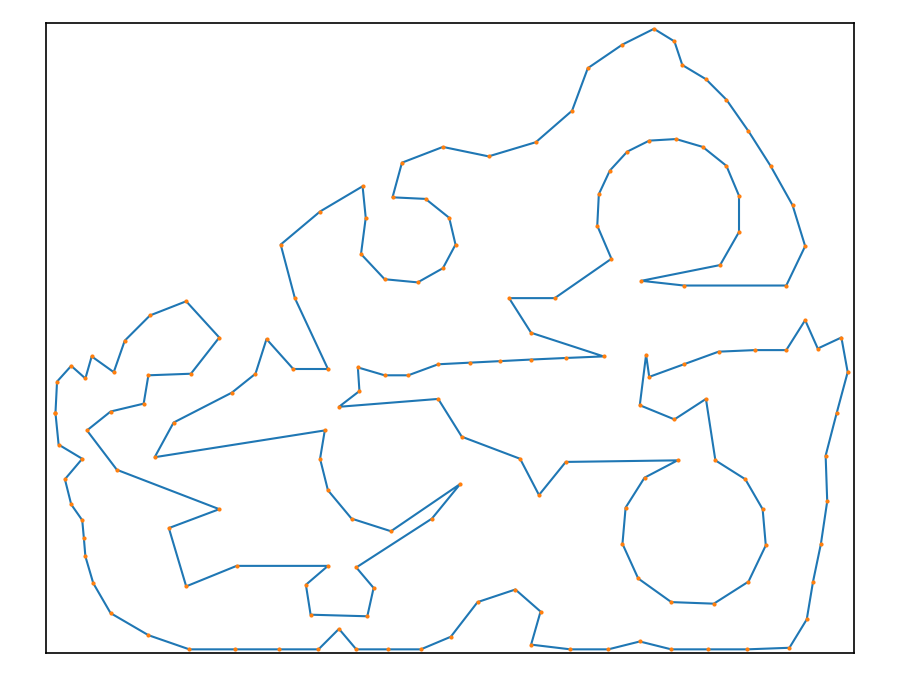
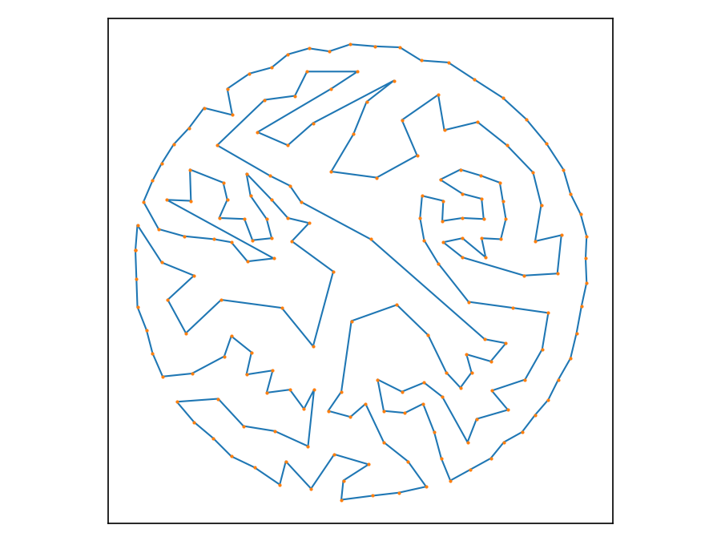

# TSPArt — TSPLIB-ready point sets and tours from images

Generate stippled **point sets** and a cleaned **TSP tour** from any image, export them in **TSPLIB** format, and preview the result with the same orientation as the image.

## What’s improved

- **TSPLIB-consistent export**: `.tsp` (EUC_2D) and `.nn_clean.tour` share the same 1..n indices.
- **Correct orientation**: coordinates are flipped to Cartesian **Y-up** before exporting, so Matplotlib shows exactly what PIL shows.
- **Auto-named outputs** in the image folder:
  - `<name>_pv.png` (preview)
  - `<name>_<N>.tsp` (points)
  - `<name>_<N>.nn_clean.tour` (heuristic cleaned tour)
- **Target point count** with light Lloyd relaxation; optional point markers in preview.

## How it works (very short)

1. Load image (PIL, grayscale) and optionally downscale.
2. Stipple by darkness + relax (Voronoi centroids).
3. Build a tour with Nearest-Neighbor, then **uncross/cleanup**.
4. **Flip Y** → export **TSPLIB** `.tsp` (EUC_2D) and `.nn_clean.tour`.
5. Save a **Matplotlib** preview matching the image’s look.

## Usage

```bash
cd code

python TSPArt.py ../images/cheese.png --target 180 --iters 8 --showPoints
python TSPArt.py ../images/face.png   --target 180 --iters 8 --showPoints
python TSPArt.py ../images/cereza.png --target 200 --iters 8 --showPoints
```

### CLI options

- `image` (positional): path to PNG/JPG.
- `--target` (int): desired number of points (heuristic).
- `--iters` (int): Lloyd-like relaxation steps.
- `--maxdim` (int): resize longest side (default 600).
- `--showPoints`: draw markers in the preview.

> Note: the final point count can be slightly **above/below** the target due to the sampling/relaxation heuristics.

## Outputs

- **Preview**: `../images/<name>_pv.png`
- **Points**: `../images/<name>_<N>.tsp` (TSPLIB, `EDGE_WEIGHT_TYPE: EUC_2D`)
- **Heuristic tour (cleaned)**: `../images/<name>_<N>.nn_clean.tour` (indices consistent with the `.tsp`)

These files follow the TSPLIB95 conventions: [http://comopt.ifi.uni-heidelberg.de/software/TSPLIB95/tsp/](http://comopt.ifi.uni-heidelberg.de/software/TSPLIB95/tsp/)

## Examples

### Image 1




### Image 2




### Image 3




## Tips

- Hide points in the preview by omitting `--showPoints`.
- Consume the `.tsp` and `.nn_clean.tour` directly in your TSP tools/visualizers; orientation will match the preview.

## Limitations

- Export is **EUC_2D** (pixel coordinates). GEO can be added if you need geographic data.

## Note on optimality

The file `<name>_<N>.nn_clean.tour` is **not a mathematically proven optimum**.  
It is a **heuristic, cleaned tour** (Nearest-Neighbor + crossing cleanup) exported for convenience.
Use it as a **baseline/seed/preview**. A metaheuristic (e.g., GA/LKH) can improve it, and only an
**exact solver** (e.g., Concorde) can certify optimality. If you obtain a certified optimum, you
may save it as `<name>_<N>.opt.tour`.
